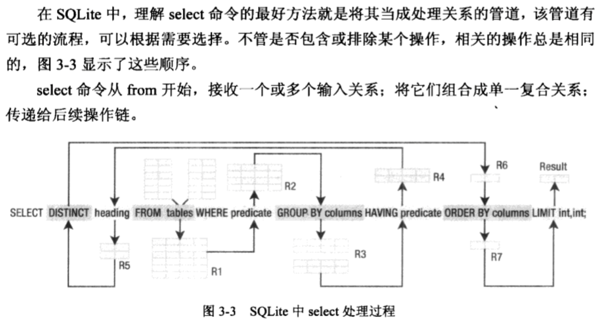
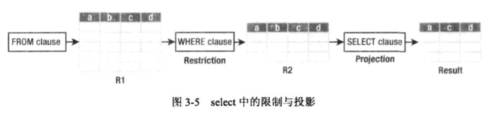
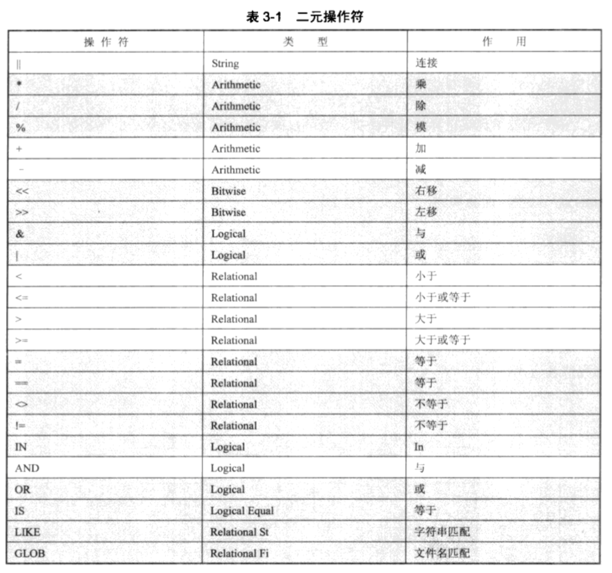
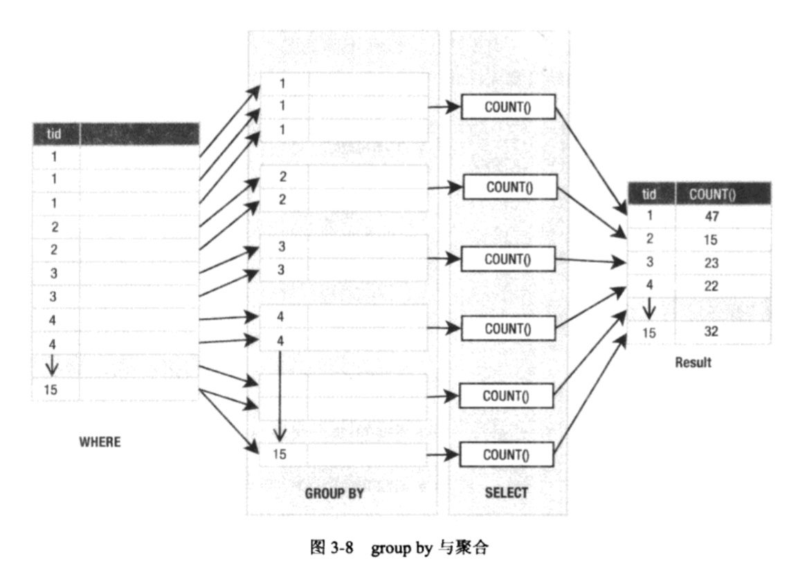

SQLite权威指南 第三章
这一章要学习使用SQL，介绍好技术和便捷的技巧。
深入学习SQL，推荐这本书 Claire Churcher的Beginning SQL Queries。
```sql
sqlite> .echo off
sqlite> .mode column
sqlite> .headers on
sqlite> .nullvalue NULL
```
```sql
select * 
from foods
where name='JujyFruit'
and type_id=9;
```
```sql
select f.name name, types.name type
from foods f
inner join(
select * 
from food_types
where id=6) types
on f.type_id=types.id;
```
命令式语言和声名式语言的区别
常量：包括字符串常量、数字常量和二进制常量。
关键字和标识符: 不区分大小写
注释:
- 单行注释
- 多行注释
```sql
create table contacts(id integer primary key,
name text not null collate nocase,
phone text not null default 'UNKNOWN',
unique(name,phone));
```
```sql
alter table contacts
add column email text not null default '' collate nocase;
```
```sql
sqlite> .schema contacts
CREATE TABLE contacts(id integer primary key,
name text not null collate nocase,
phone text not null default 'UNKNOWN', email text not null default '' collate nocase,
unique(name,phone));
sqlite> 
```
Select语句，提供:
- 混合
- 比较
- 过滤
数据的“关系操作”。这些关系操作通常划分为3种类型:
- 基本操作
   * 限制
   * 投影
   * 笛卡尔积
   * 联合
   * 差
   * 重命名
定义了基础的关系操作，在集合论中有理论基础。
- 附加操作
   * 交叉
   * 自然连接
   * 赋值
附加操作是为了方便，提供了频繁执行操作的快速方式。
都是由基本操作组成的。
举例：交叉操作。
1. 取两个集合的联合
2. 区分操作删除两个结果
3. 进一步联合有彼此差异的两个初始集合。
- 扩展操作
   * 广义投影
   * 左外连接
   * 右外连接
   * 全外连接
扩展操作是对基本操作和附加操作的扩展。
举例1：广义投影操作。
在基本的映射操作基础上：
添加
1. 算数表达
2. 聚集
3. 分组
功能。
举例2：外连接。
扩展了连接操作，允许从数据库获取额外的信息或不完全的信息。
SQLite支持ANSI SQL中除了right和full outer join之外的所有操作。
说明：这些操作可以用其他基本的关系操作完成，不用担心缺乏右外连接和全外连接。
一个或者多个表作为输入，产生另外一个表作为输出。
从语法上说，
select命令用一系列子句，
将很多操作组合在一起，
每个子句代表一种特定的关系操作。
select命令的通用形式如下:
select [distinct] _heading_
from _tables_
where _predicate_
group by _columns_
having _predicate_
order by _columns_
limit count, offset;
<div><br></div>
from子句:
参数是由逗号分隔的一个或者多个表、视图等。
1. 如果指定多个表，它们会组成单一关系，通过连接操作完成。(R1)
2. from产生的结果作为最初的数据表。
3. 后续操作使用最初数据表继续产生内容。
where子句:
参数是predicate, 或者是逻辑表达式。
1. 定义了行的选择标准。
2. 从where中选中的行形成新的关系R2。
select子句：
1. 除了select之外，其他的子句都是可选的。
2. 最常见的select命令由三个字句组成: select、from、where。
   select heading from tables where predicate;
3. 定义了列的选择标准。
4. * 表示选择所有的列。
限制与投影归纳总结：
1. 处理收集from中的所有数据。
2. 在where中过滤行。
3. 在select中过滤列。
<div><br></div>
过滤：
1. 如果select是SQL中最复杂的命令，那么where就是select中最复杂的子句。
2. where子句的主语是行，子句是逻辑预测，评估为真的行包含在结果集中。
值：
1. 文字的值
2. 变量
3. 表达式
4. 函数的结果
操作符:
1. 单目
2. 二元
3. 三元
4. 操作管道
二元操作符
<div><br></div>
select 1 > 2;
select 1 < 2;
select 1 = 2;
select -1 AND 1;
逻辑操作符
```sql
select * from foods where name='JujyFruit' and type_id=9;
```
LIKE与GLOB操作符
```sql
select id,name from foods where name like 'J%';
select id,name from foods where name like '%ac%P%' and name not like '%Sch%';
```
1. GLOB操作符在行为上与LIKE操作符非常相似。
2. 关键不同在于它有些想unix文件名替换语法。
3. 它使用文件名替换相关的通配符，例如*和_。
4. 匹配是大小写敏感的。
```sql
select id,name from foods where name glob 'Pine*';
```
正则表达式
1. 识别match和regexp正则表达式断言，但目前不提供自身实现。
2. 开发自己的sqlite_create_function()调用。(见chapter 5)
限定和排序
1. limit限定记录的最大数量。
2. offset限定偏移的记录数。
3. 它们都不是ANSI标准中定义的关键字。绝大多数数据库都有同等功能，但是语法会有所不同。
4. limit和offset一起使用时，可以用逗号替代offset关键字。
5. limit和offset是放在最后面的。
6. 限制了行数，但不会加速查询。只会有不很大的性能改善，追踪的值相对少一些。
注意：
1. SQLite中，使用缩写时，offset总是优先于limit。
2. offset依赖于limit。可以只用limit，不用offset。反之不行。
```sql
select * from food_types order by id limit 1 offset 1;
```
以下两个等价：
```sql
select * from foods where name like 'B%' order by type_id desc, name asc limit 10 offset 2;
```
```sql
select * from foods where name like 'B%' order by type_id desc, name asc limit 2, 10;
```
order by子句的语法:
1. 和select子句语法类似。
2. 逗号分隔一系列字段。
3. 每个字段项都可能配合排序方向。
4. asc和desc。
5. 第一字段重复，按照第二字段排序。以此类推。
函数和聚合(Function and Aggregate)
函数种类：
1. 数学函数。abs()
2. 字符串格式函数。upper()和lower()
```sql
select upper('hello newman'),length('hello newman'),abs(-12);
```
```sql
select id, upper(name),length(name) from foods where type_id=1 limit 10;
```
函数可以是任意表达式的一部分，比如用在where子句中。
```sql
select id,upper(name),length(name) from foods where length(name)<5 limit 5;
```
聚合是特殊函数。
从一组记录中计算聚合值。
1. sum()
2. avg()
3. count()
4. min()
5. max()
```sql
select count(*) from foods where type_id=1;
```
1. 可以聚合字段。
2. 可以聚合任何表达式，包括函数。
3. 可以对from子句选中的行进行计算。
4. 可以对where子句选中的行进行计算。
```sql
select avg(length(name)) from foods;
```
SQLite有一组标准的常用SQL函数和聚合。
SQLite C API允许您创建自定义的函数和聚合。(见Chapter 7)
分组(Grouping)
1. 聚合不只能够计算整个结果集的聚合值。
2. 还可把结果集分成多个组，然后计算每个组的聚合值。
```sql
select type_id from foods group by type_id;
```
group by子句:
1. 它介于where和select子句之间。
2. 它接收where的输出。将输出分隔成某个字段或多个字段上同等值的小组。
3. 这些组再传递给select子句。
4. select接收时，同等值字段可以直接显示，不同等值字段要进行聚合显示。(个人经验总结)
5. select子句对每组单独应用聚合，而不对整个结果聚合。
6. 聚合对每组生成一个值，这个值作为一个组的单行。
```sql
select type_id,count(*) from foods group by type_id;
```
<div><br></div>


