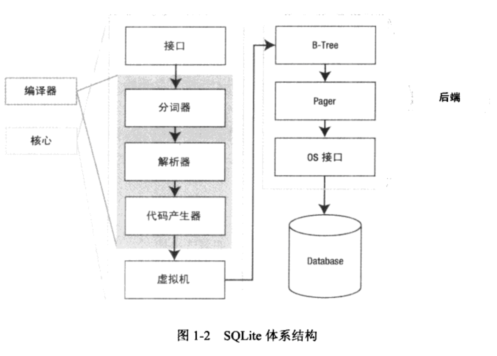
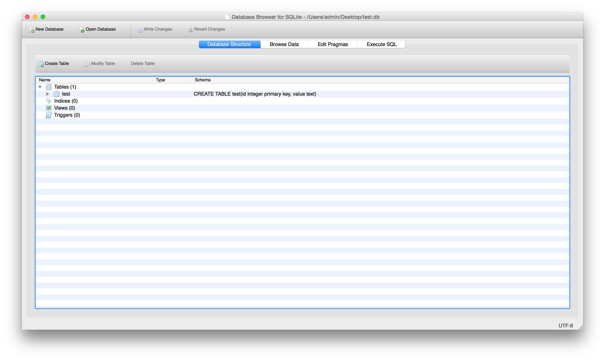
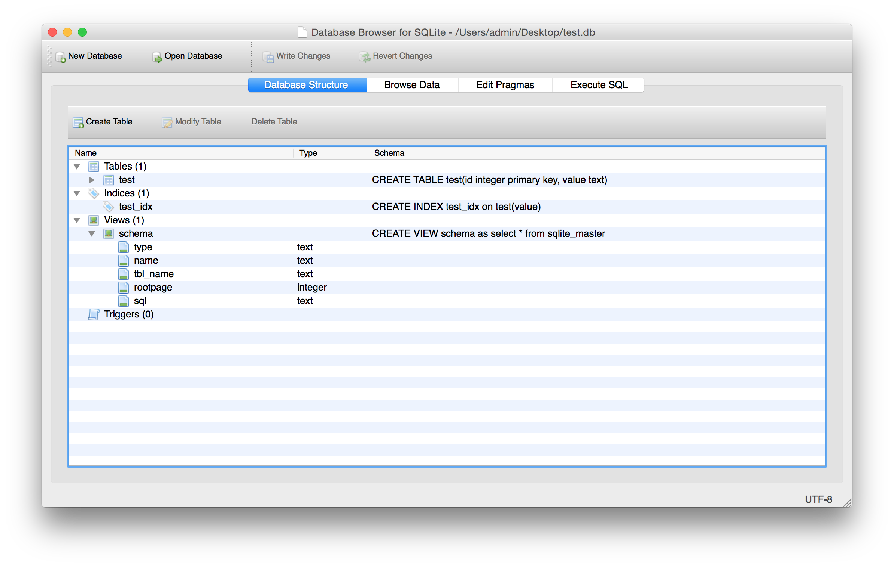
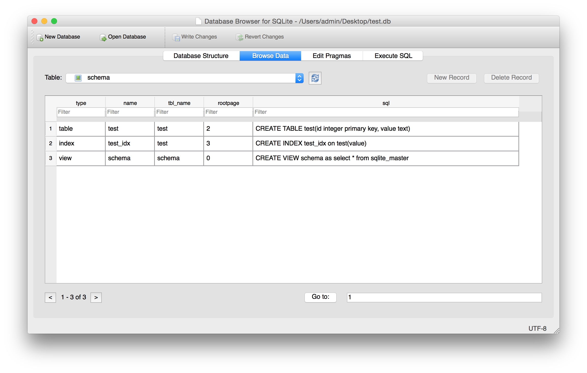

SQLite权威指南 第一章
<div><br></div>
#1. 熟悉一下，了解一些概念
##1.1 这是一个很复杂的查询，用SQL来做就很容易
```sql
SELECT x, STDDEV(w)
	FROM table
	GROUP BY x
	HAVING x > MIN(z) OR x < MAX(y)
	ORDER BY y DESC
	LIMIT 10 OFFSET 3;
```
##1.2 一段经典的总结话语
#####如果您已经熟悉SQL，想象一下，以熟悉的编程语言编码实现同等的子查询、组合查询、排序字句或者多个连接，需要多少工作。SQLite以最小的代价将这些功能嵌入在应用程序中。数据库引擎直接集成到代码中，您可以讲SQL看成是离线引擎，通过它可以在程序中实现复杂的排序算法。随着数据集的不断增大，这种方式的优势越来越明显，因为如果自己写代码，算法会越来越复杂。更好的是，SQLite可以配置使用固定大小的内存，如果数据大小超过了指定限制，可以将数据存放到磁盘。如果自己写算法，实现这一功能会更困难。使用SQLite，通过一个SQL命令就可以实现这一功能。

#####对程序员而言，SQLite还是一个很好的学习程序设计的工具—研究计算机科学主题的聚宝盆。词法分析器、语法分析器、虚拟机、B-tree算法、缓存、程序架构等，这是探究很多计算机科学经典概念非常好的方式。SQLite的模块化、小型化和简易性使得它很容易将一个个主题作为单独学习的例子，任何人都可以较快地理解。
#2. 开始实践操作吧。
##2.1 SHELL模式下的CLP(What is CLP?)
##2.2 命令行模式的CLP。
```sql
	Admin:Desktop admin$ sqlite3 test.db
	SQLite version 3.8.5 2014-08-15 22:37:57
	Enter ".help" for usage hints.
	sqlite> create table test(id integer primary key, value text);
	sqlite> insert into test(id,value) values(3,'frank');
	sqlite> insert into test(id,value) values(2,'mark');
	sqlite> insert into test(value) values("jack");
	sqlite> insert into test(value) values("Jim");
```
#3. 有关.mode
##3.1 直接输入.mode，看看提示什么？
```sql
 sqlite> .mode
 Error: mode should be one of: column csv html insert line list tabs tcl
```
##3.2 首先我们来试试设置显示成column
```sql
	sqlite> .mode column
	sqlite> select * from test;
	2           mark      
	3           frank     
	4           jack      
	5           Jim 
```
##3.3 html模式看起来也很好，直接形成一个正确的内容。
```sql
 sqlite> .mode html
 sqlite> select * from test;
 <TR><TD>2</TD>
<TD>mark</TD>
</TR>
<TR><TD>3</TD>
<TD>frank</TD>
</TR>
<TR><TD>4</TD>
<TD>jack</TD>
</TR>
<TR><TD>5</TD>
<TD>Jim</TD>
</TR>
<TR><TD>6</TD>
<TD>Mary</TD>
</TR>
```
##3.4 需要csv吗？
```sql
sqlite> .mode csv
 sqlite> select * from test;
 2,mark
 3,frank
 4,jack
 5,Jim
```
##3.5 list是个默认的模式
```sql
 sqlite> .mode list
 sqlite> select * from test;
 2,mark
 3,frank
 4,jack
 5,Jim
```
##3.6 line显示内容很完整，遇到不完整的情况试试它。
```sql
 sqlite> .mode line
 sqlite> select * from test;
  id = 2
 value = mark
 
  id = 3
 value = frank
 
  id = 4
 value = jack
 
  id = 5
 value = Jim
```
##3.7 还有insert模式，可以直接找到这种语句。
```sql
 sqlite> .mode insert
 sqlite> select * from test;
 INSERT INTO table VALUES(2,'mark');
 INSERT INTO table VALUES(3,'frank');
 INSERT INTO table VALUES(4,'jack');
 INSERT INTO table VALUES(5,'Jim');
```
##3.8 tabs模式
```sql
 sqlite> .mode tabs
 sqlite> select * from test;
 2	mark
 3	frank
 4	jack
 5	Jim
```
##3.9 tcl模式
```sql
 sqlite> .mode tcl
 sqlite> select * from test;
 "2" "mark"
 "3" "frank"
 "4" "jack"
 "5" "Jim"
```
#4. 有关.headers on,就是显示头
```sql
id value
 ------ ----------
 2 mark
 3 frank
 4 jack
 5 Jim
```
#5. 选择上一次添加的id
```sql
 sqlite> insert into test(value) values("Mary");
 sqlite> select last_insert_rowid();
 last_insert_rowid()
 ---------------
 6
```
```sql
 sqlite> select * from test;
 id value
 ------ ----------
 2 mark
 3 frank
 4 jack
 5 Jim
 6 Mary
```
#6. 添加一个index(有截图)
```sql
 sqlite> create index test_idx on test(value);
 
```
#7. 添加一个view名字为schema(有截图)

```sql
 sqlite> create view schema as select * from sqlite_master;

```
创建前和创建后，在sqlitebrowser中的变化
<div><br></div>
<div><br></div>
<div><br></div>
#8. 一些管理维护的内容
##8.1 命令.tables[pattern]可以得到所有表和视图的列表，其中[pattern]可以是任何like操作符理解的SQL
##8.2 命令.indices [table name]，显示一个表的索引。
##8.3 命令.schema [table name]，得到一个表或者视图的定义语句。
如果不提供表名，就会返回所有数据库对象(包括table、index、view和trigger)的定义语句。
```sql
	sqlite> select type, name,tbl_name, sql from sqlite_master order by type;
	type        name        tbl_name    sql                                 
	------  ----------  ----------  ------------------------------------
	index       test_idx    test        CREATE INDEX test_idx on test(value)
	table       test        test        CREATE TABLE test(id integer primary
	view        schema      schema      CREATE VIEW schema as select * from
```
注:下面的这种情况显示不完全，我们换一种mode，就看到完整的sql语句。
```sql
sqlite> select type, name,tbl_name, sql from sqlite_master order by type;
    type = index
    name = test_idx
tbl_name = test
     sql = CREATE INDEX test_idx on test(value)

    type = table
    name = test
tbl_name = test
     sql = CREATE TABLE test(id integer primary key, value text)

    type = view
    name = schema
tbl_name = schema
     sql = CREATE VIEW schema as select * from sqlite_master
```
##8.4 导出可以产生db的sql文件
```sql
sqlite> .output file.sql
sqlite> .dump
sqlite> .output stdout
```
##8.5 显示很多配置信息
```sql
	sqlite> .show
	 echo: off
	  eqp: off
	  explain: off
	  headers: on
	 mode: column
	nullvalue: ""
	   output: stdout
	separator: "|"
	stats: off
	width: 
	
```
关注其中的.separator，以及nullvalue，这都是有指令设置的。
##8.6 通过sql文件产生db文件
```sql
	sqlite> drop table test;
	sqlite> drop view schema;
	sqlite> .read file.sql
```
##8.7 设置prompt显示内容
```sql
	sqlite> .prompt 'sqlite3> '
	sqlite3> .prompt ' frank is great'
	 frank is great.prompt 'sqlite3> '
	sqlite3> 

```
##8.8 select的结果，导出为csv格式
```sql
	sqlite3> .output file.csv
	sqlite3> .separator ,
	sqlite3> select * from test;
	sqlite3> .output stdout
```
```sql
	sqlite3> .output file.csv
	sqlite3> .mode csv
	sqlite3> select * from test;
	sqlite3> .output stdout
```
```sql
	sqlite3> .mode list
	sqlite3> select * from test;
	id,value
	2,mark
	3,frank
	4,jack
	5,Jim
	6,Mary
```
```sql
	sqlite3> .separator <>
	sqlite3> select * from test;
	id<>value
	2<>mark
	3<>frank
	4<>jack
	5<>Jim
	6<>Mary
	sqlite3> .separator ,
```


